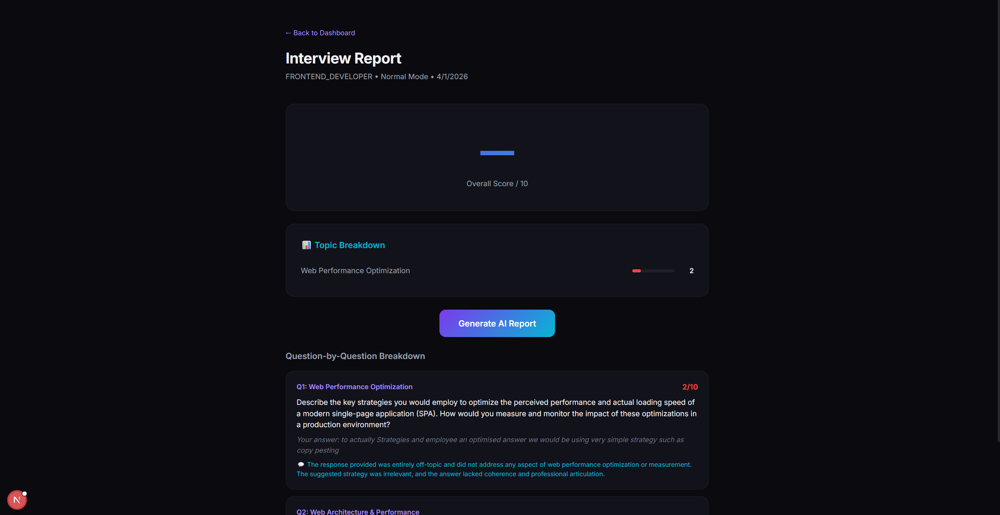
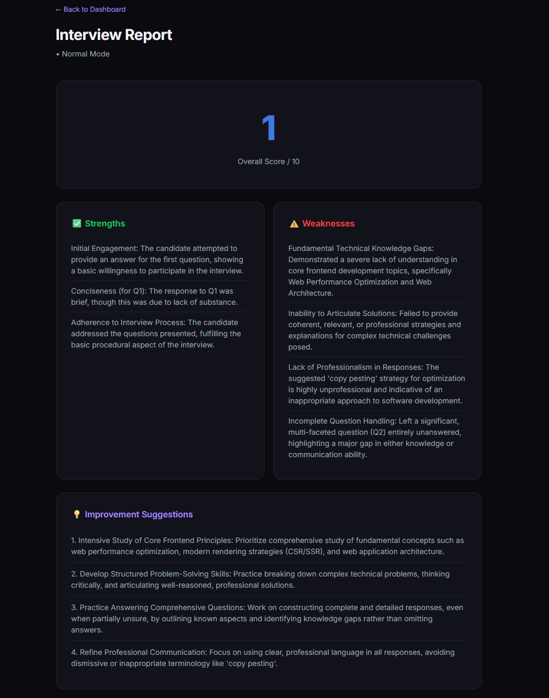

# Smart Ai Interviewer

**Adaptive Voice-Based Interview Simulation & Weakness Mapping Platform**


Smart Ai Interviewer is an AI-driven interview simulation platform that uses voice interaction to provide realistic, adaptive mock interviews. Unlike conventional mock-interview apps (mostly text-only or static), our system speaks questions aloud (using text-to-speech) and listens to spoken answers (using speech-to-text). It dynamically adapts each next question based on previous answers, employing large language models (LLMs) and NLP to understand the context, analysing the given answer for Clarity and Confidence and also Scoring based on that. After the interview, it generates a structured report highlighting strengths and weaknesses (weakness mapping), along with actionable feedback. Early internal tests show that users find the voice-based interaction more engaging and realistic than text-only quizzes.

## Tech Stack

| Layer | Technology |
|-------|-----------|
| **Frontend** | Next.js 15, TypeScript, Tailwind CSS, Framer Motion |
| **Backend** | Node.js, NestJS (7 microservices) |
| **Database** | PostgreSQL 16 + Prisma ORM |
| **Cache/Queue** | Redis 7 + BullMQ |
| **AI** | Gemini (free tier), Local Whisper (STT), edge-tts (TTS) |
| **Infra** | Docker Compose, Turborepo monorepo |

## Project Structure

```
voxhire-ai/
├── apps/
│   ├── web/                          # Next.js frontend
│   └── services/
│       ├── api-gateway/              # Entry point, rate limiting, routing
│       ├── auth-service/             # JWT auth, Redis session cache
│       ├── interview-service/        # Core orchestrator (adaptive logic)
│       ├── voice-service/            # edge-tts + Whisper STT
│       ├── scoring-service/          # AI evaluation + aggregation
│       ├── analytics-service/        # Reports, weakness mapping, history
│       └── storage-service/          # File storage (audio, reports)
├── packages/
│   ├── shared-types/                 # TypeScript types & DTOs
│   ├── config/                       # Centralized env config (zod)
│   ├── db/                           # Prisma schema & client
│   └── ai-provider/                  # Abstracted AI interface (Gemini)
├── docker-compose.yml                # PostgreSQL + Redis
├── turbo.json                        # Turborepo config
└── docs/                             # Product & engineering docs
```





## Quick Start

### Prerequisites
- Node.js 18+
- Docker & Docker Compose
- Python 3.8+ (for Whisper & edge-tts)

### 1. Clone & Install
```bash
git clone <repo-url>
cd voxhire-ai
cp .env.example .env    # Edit with your Gemini API key
npm install
```

### 2. Start Infrastructure
```bash
docker-compose up -d    # Starts PostgreSQL + Redis
```

### 3. Setup Database
```bash
cd packages/db
npx prisma generate
npx prisma db push
```
cd ..
### 4. Install Python Dependencies
```bash
pip install edge-tts openai-whisper
```

### 5. Run Development
```bash
npm run dev             # Starts all services + frontend
```

### Individual Services
```bash
npm run dev:web         # Frontend only (localhost:3000)
npm run dev:gateway     # API Gateway only (localhost:4000)
npm run dev:services    # All backend services
```

## Service Ports

| Service | Port |
|---------|------|
| Frontend | 3000 |
| API Gateway | 4000 |
| Auth Service | 4001 |
| Interview Service | 4002 |
| Voice Service | 4003 |
| Scoring Service | 4004 |
| Analytics Service | 4005 |
| Storage Service | 4006 |
| PostgreSQL | 5432 |
| Redis | 6379 |

## Environment Variables

See `.env.example` for all required variables.

## License

Private project.
