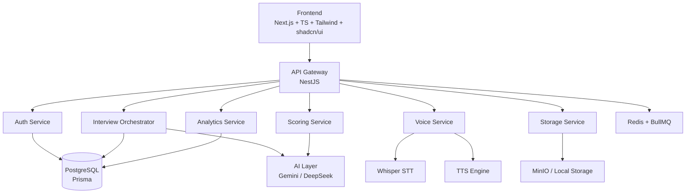

# VoxHire AI — Implementation Plan

## System Understanding

**VoxHire AI** is a voice-first, adaptive interview simulation platform. It is **not** a chatbot — it is a structured interview engine that:

1. Asks questions via **generated voice** (TTS)
2. Listens to the user's spoken answer (browser mic → audio recording)
3. Transcribes the answer via **Whisper** (STT)
4. Evaluates correctness, communication, and confidence via **Gemini** (LLM)
5. Adapts the next question based on performance (weakness mapping, difficulty adjustment)
6. Generates a structured **final report** (strengths, weaknesses, scores)

Two interview modes: **Normal** (realistic pacing, follow-ups) and **Rapid Fire** (timer, pressure, speed).

The product must feel **premium, polished, and modern** — dark theme, glassmorphism, smooth animations, waveform voice UI.

---

## Architecture Summary



---

## Finalized Technology Decisions

| Decision | Choice | Rationale |
|----------|--------|----------|
| **Runtime** | Node 18+ | User confirmed |
| **Monorepo** | Turborepo | Single repo for all apps/packages |
| **Service Comms** | REST via API Gateway | Simple for MVP |
| **Whisper (STT)** | Local Whisper via Python sidecar | Free, runs locally |
| **TTS** | **edge-tts** (primary) + Browser Web Speech API (fallback) | edge-tts uses Microsoft Edge's free cloud TTS — excellent quality, multiple natural voices, zero cost. Falls back to browser API if unavailable. |
| **LLM** | Gemini free tier (Google AI Studio) | Free tier available |
| **Redis** | Session caching, rate limiting, BullMQ jobs, interview state | Used extensively (see below) |

### Redis Usage Plan

Redis will be a core infrastructure component, not just an add-on:

| Use Case | Service | How |
|----------|---------|-----|
| **Session caching** | Auth Service | Cache JWT session data, avoid DB lookups on every request |
| **Interview state** | Interview Orchestrator | Store live interview state (current question index, scores so far, timer state) in Redis for fast reads during active sessions |
| **Rate limiting** | API Gateway | `@nestjs/throttler` with Redis store for distributed rate limiting |
| **Background jobs** | Voice, Scoring, Analytics | BullMQ queues via Redis for async transcription, scoring, report generation |
| **TTS audio caching** | Voice Service | Cache generated TTS audio for repeated questions to avoid re-generation |
| **Pub/Sub** | Interview Orchestrator | Real-time interview progress events (question delivered, answer received, score ready) |

---

## Proposed Changes

### Phase 1 — Foundation (Starting Here)

This is the first build phase. We set up the entire project skeleton, making every future phase a matter of filling in logic.

---

### Monorepo Root

#### [NEW] [package.json](file:///y:/Projects/interview/package.json)
- Root workspace config for Turborepo with `apps/*` and `packages/*` workspaces

#### [NEW] [turbo.json](file:///y:/Projects/interview/turbo.json)
- Turborepo pipeline config (`build`, `dev`, `lint`)

#### [NEW] [docker-compose.yml](file:///y:/Projects/interview/docker-compose.yml)
- Services: PostgreSQL, Redis, MinIO, all backend microservices
- Network configuration for inter-service communication

#### [NEW] [.env.example](file:///y:/Projects/interview/.env.example)
- Template for all environment variables (DB, Redis, AI keys, JWT secret)

#### [NEW] [.gitignore](file:///y:/Projects/interview/.gitignore)
- Standard Node.js + Next.js + Docker ignores

---

### Frontend — `apps/web/`

#### [NEW] [apps/web/](file:///y:/Projects/interview/apps/web/)
- Next.js 14+ app with App Router
- TypeScript strict mode
- Tailwind CSS with dark theme config
- shadcn/ui component library initialized
- Framer Motion for animations

Key pages/routes:
| Route | Purpose |
|-------|---------|
| `/` | Landing page — premium, animated hero |
| `/auth/login` | Login screen |
| `/auth/signup` | Signup screen |
| `/dashboard` | User dashboard — start interview, view history |
| `/interview/[sessionId]` | Interview room — voice UI, waveform, timer |
| `/report/[sessionId]` | Final report — scores, charts, strengths/weaknesses |
| `/history` | Session history list |

Key components planned:
- `VoiceWaveform` — animated waveform during listening/speaking
- `InterviewTimer` — countdown for rapid fire mode
- `QuestionCard` — glassmorphic question display
- `ScoreRadial` — radial score visualization
- `RoleSelector` — interview role picker cards
- `ModeSelector` — Normal vs Rapid Fire selection

---

### Backend Services — `apps/services/`

Each service is a standalone NestJS app with its own `Dockerfile`.

#### [NEW] [apps/services/api-gateway/](file:///y:/Projects/interview/apps/services/api-gateway/)
- Entry point for all frontend requests
- Auth middleware (JWT verification)
- Route proxying to downstream services
- Rate limiting (via `@nestjs/throttler`)

#### [NEW] [apps/services/auth-service/](file:///y:/Projects/interview/apps/services/auth-service/)
- Signup/Login endpoints
- JWT token generation + refresh
- Password hashing (bcrypt)
- User profile CRUD

#### [NEW] [apps/services/interview-service/](file:///y:/Projects/interview/apps/services/interview-service/)
- Core orchestrator — **the most important service**
- Session lifecycle management (create, progress, complete)
- Mode logic (Normal vs Rapid Fire)
- Question selection pipeline (calls AI layer)
- Adaptive logic controller

#### [NEW] [apps/services/voice-service/](file:///y:/Projects/interview/apps/services/voice-service/)
- **TTS**: Uses `edge-tts` (Python subprocess) — free, high-quality Microsoft voices. Falls back to Browser Web Speech API on the frontend.
- **STT**: Accepts user audio → sends to local Whisper Python sidecar → returns transcript
- Audio format handling (WebM → WAV conversion)
- **Redis**: Caches generated TTS audio blobs to avoid re-generating for repeated questions

#### [NEW] [apps/services/scoring-service/](file:///y:/Projects/interview/apps/services/scoring-service/)
- Receives transcript + question context
- Calls Gemini for evaluation
- Returns structured scores (semantic, clarity, confidence, hesitation, filler)

#### [NEW] [apps/services/analytics-service/](file:///y:/Projects/interview/apps/services/analytics-service/)
- Weakness mapping aggregation
- Session summary generation
- Final report compilation (calls Gemini)
- Strength/weakness detection

#### [NEW] [apps/services/storage-service/](file:///y:/Projects/interview/apps/services/storage-service/)
- Audio file upload/retrieval
- Report artifact storage
- MinIO integration (or local filesystem for MVP)

---

### Shared Packages — `packages/`

#### [NEW] [packages/shared-types/](file:///y:/Projects/interview/packages/shared-types/)
- TypeScript interfaces/types shared across frontend and backend
- `InterviewSession`, `Question`, `Response`, `Score`, `User`, `Report` types
- API request/response DTOs
- Enum definitions (InterviewMode, Role, Difficulty)

#### [NEW] [packages/db/](file:///y:/Projects/interview/packages/db/)
- Prisma schema + client
- Migration files
- Seed scripts

#### [NEW] [packages/ai-provider/](file:///y:/Projects/interview/packages/ai-provider/)
- Abstracted AI interface (`AIProvider`)
- `GeminiProvider` implementation
- Placeholder for `DeepSeekProvider`
- Prompt templates for question generation, evaluation, report generation

#### [NEW] [packages/config/](file:///y:/Projects/interview/packages/config/)
- Centralized env config loader
- Validation (using `zod` or `joi`)

---

### Database Schema — `packages/db/prisma/schema.prisma`

#### [NEW] [schema.prisma](file:///y:/Projects/interview/packages/db/prisma/schema.prisma)

Core models matching doc [07-database-design.md](file:///y:/Projects/interview/docs/07-database-design.md):

```prisma
model User {
  id           String   @id @default(uuid())
  name         String
  email        String   @unique
  passwordHash String
  createdAt    DateTime @default(now())
  updatedAt    DateTime @updatedAt
  sessions     InterviewSession[]
}

model InterviewSession {
  id            String   @id @default(uuid())
  userId        String
  mode          InterviewMode
  role          String
  difficulty    Difficulty @default(MEDIUM)
  startedAt     DateTime @default(now())
  endedAt       DateTime?
  overallScore  Float?
  status        SessionStatus @default(IN_PROGRESS)
  user          User     @relation(fields: [userId], references: [id])
  questions     Question[]
  responses     Response[]
  weaknessTags  WeaknessTag[]
  finalReport   FinalReport?
}

model Question {
  id           String   @id @default(uuid())
  sessionId    String
  questionText String
  topic        String
  difficulty   Difficulty
  orderIndex   Int
  questionType String?
  generatedBy  String   @default("gemini")
  session      InterviewSession @relation(...)
  response     Response?
}

model Response {
  id              String   @id @default(uuid())
  questionId      String   @unique
  sessionId       String
  transcript      String
  audioUrl        String?
  durationSeconds Float?
  submittedAt     DateTime @default(now())
  question        Question @relation(...)
  session         InterviewSession @relation(...)
  score           Score?
}

model Score {
  id              String @id @default(uuid())
  responseId      String @unique
  semanticScore   Float
  clarityScore    Float
  confidenceScore Float
  hesitationScore Float
  fillerScore     Float
  finalScore      Float
  aiFeedback      String?
  response        Response @relation(...)
}

model WeaknessTag {
  id           String @id @default(uuid())
  sessionId    String
  topic        String
  weaknessType String
  severity     String
  session      InterviewSession @relation(...)
}

model FinalReport {
  id                     String @id @default(uuid())
  sessionId              String @unique
  strengthsSummary       String
  weaknessSummary        String
  improvementSuggestions String
  reportJson             Json?
  createdAt              DateTime @default(now())
  session                InterviewSession @relation(...)
}

enum InterviewMode { NORMAL, RAPID_FIRE }
enum Difficulty { EASY, MEDIUM, HARD }
enum SessionStatus { IN_PROGRESS, COMPLETED, ABANDONED }
```

---

## Build Order (Within Phase 1)

| Step | What | Why |
|------|------|-----|
| 1 | Monorepo scaffolding | Everything depends on this |
| 2 | `packages/shared-types` + `packages/config` | Services need types and config |
| 3 | `packages/db` (Prisma schema) | Services need DB access |
| 4 | `packages/ai-provider` (interface + Gemini stub) | Interview/Scoring services need this |
| 5 | Backend service skeletons (all 7 NestJS apps) | Empty but runnable |
| 6 | Frontend shell (Next.js + pages + layout) | Empty but navigable |
| 7 | Docker Compose | Everything runs together |
| 8 | README.md | Setup instructions |

---

## Verification Plan

### Automated Checks
1. **Build check**: `npm run build` from root should compile all packages and services without errors
2. **Type check**: `npx tsc --noEmit` in each service and frontend to verify TypeScript
3. **Prisma validation**: `npx prisma validate` in `packages/db` to verify schema
4. **Docker**: `docker-compose build` should build all service images
5. **Lint**: `npm run lint` should pass across the monorepo

### Manual Verification
1. **Frontend**: Run `npm run dev` in `apps/web`, open `http://localhost:3000` — landing page should render with dark theme, animations
2. **API Gateway**: Run backend services, hit `http://localhost:4000/health` — should return `{ status: "ok" }`
3. **Database**: Run `npx prisma migrate dev` — should create all tables in PostgreSQL
4. **Docker Compose**: Run `docker-compose up` — all services, PostgreSQL, and Redis should start without errors

> [!NOTE]
> Since this is a greenfield project (Phase 1 = foundation/skeleton), there are no existing tests to run. Unit and integration tests will be added in Phase 2 alongside actual business logic. Phase 1 verification focuses on **structural correctness** — everything compiles, connects, and starts.
